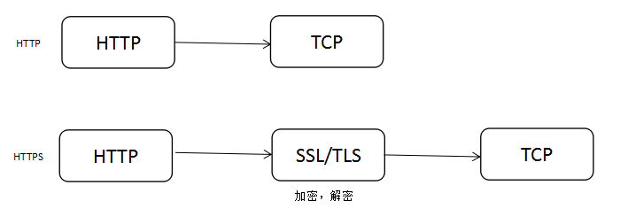
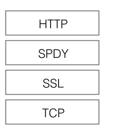
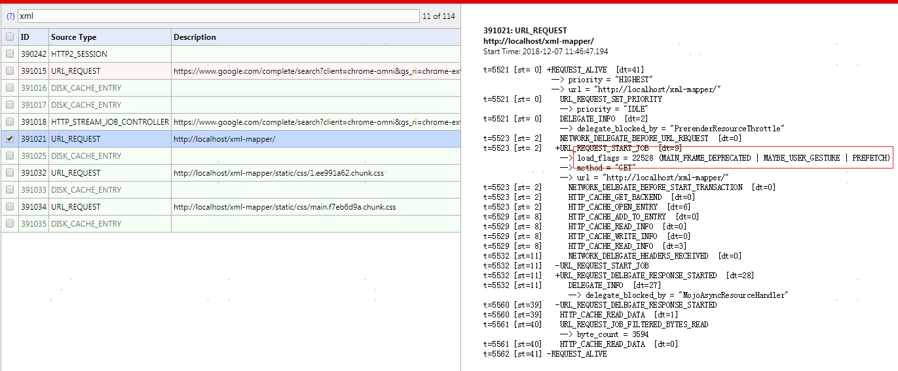
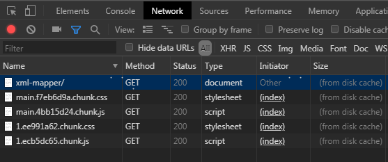
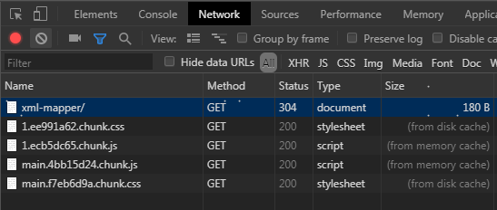
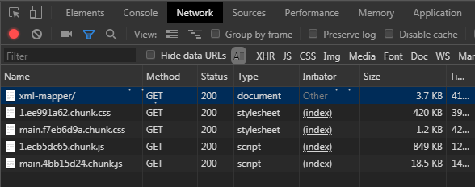

# Lazylogs

<!-- TOC -->

- [Lazylogs](#lazylogs)
  - [HTTP, HTTPS, SPDY, HTTP2](#http-https-spdy-http2)
    - [http 与 https](#http-与-https)
    - [SPDY 与 http2](#spdy-与-http2)
  - [正则匹配](#正则匹配)
  - [HTTP 缓存不为人知的一面](#http-缓存不为人知的一面)
    - [request header 里的 no-cache](#request-header-里的-no-cache)
    - [response 里既没有 expire，也没有 cache-control 字段？](#response-里既没有-expire也没有-cache-control-字段)
    - [chrome 对缓存过的资源，缓存策略因不同的打开方式而异](#chrome-对缓存过的资源缓存策略因不同的打开方式而异)

<!-- /TOC -->

## HTTP, HTTPS, SPDY, HTTP2

### http 与 https

SSL，Secure Socket Layer，安全套接字层。

TLS，Transport Layer Security，传输层安全协议，可以认为是 SSL3.1，写入 RFC 标准。

SSL/TLS 是在 HTTP 和 TCP 之间的增加一层协议，把 HTTP 的明文加密后再通过 TCP 传输。



### SPDY 与 http2

SPDY 是由 google 提出的，在 HTTP 和 SSL/TLS 之间增加一层协议，解决老版本 HTTP 协议问题的方案。

http2 是 SPDY 的升级版，支持明文 HTTP 和 HTTPS，SPDY 强制使用 HTTPS。



---

## 正则匹配

\*和+默认为贪婪匹配，在它们后面加?转换为非贪婪模式。

```javascript
"<H1>正则</H1>".match(/<.*>/); // ['<H1>正则</H1>', ...]
"<H1>正则</H1>".match(/<.*?>/); // ['<H1>', ...]
```

`(pattern)`，匹配 pattern 并获取这一匹配。所获取的匹配可以从产生的 Matches 集合得到，在 JScript 中使用 $0…$9 属性。

```javascript
"<H1>正则</H1>".match(/(<.+?>)(.+)(<.+>)/); // ["<H1>正则</H1>", "<H1>", "正则", "</H1>", ...]
"<H1>正则</H1>".replace(/(<.+?>)(.+)(<.+>)/, "$2"); // '正则'
```

_非获取匹配，不进行存储供以后使用，预查不消耗字符。_

`(?:pattern)`，匹配 pattern 但不获取匹配结果，也就是说这是一个非获取匹配，不进行存储供以后使用。

```javascript
"<H1>正则</H1>".match(/(<.+?>)(.+)(?:<.+>)/); //  ["<H1>正则</H1>", "<H1>", "正则", ...]
"<H1>正则</H1>".replace(/(<.+?>)(?:.+)(<.+>)/, "$2"); // '</H1>'
```

`(?=pattern)`，正向肯定预查（look ahead positive assert），不匹配 pattern，非获取匹配，不消耗字符。

```javascript
"<H1>正则</H1>".match(/(<.+?>)(.+)(?=<.+>)/); // ["<H1>正则", "<H1>", "正则", ...]
```

`(?!pattern)`，正向否定预查(negative assert)，不匹配 pattern，非获取匹配，不消耗字符。

```javascript
"<H1>正则</H1>".match(/(<.+?>)(.+?)(?!<.+>)/); // ["<H1>正", "<H1>", "正", ...]
```

> `(?<=pattern)`，反向(look behind)肯定预查，与正向肯定预查类似，只是方向相反。例如，"(?<=95|98|NT|2000)Windows"能匹配"2000Windows"中的"Windows"，但不能匹配"3.1Windows"中的"Windows"。

> `(?<!pattern)`，反向否定预查，与正向否定预查类似，只是方向相反。例如"(?<!95|98|NT|2000)Windows"能匹配"3.1Windows"中的"Windows"，但不能匹配"2000Windows"中的"Windows"。

例子：

```javascript
"<H1>正则</H1>".replace(/(?<=<H1>)(.+)(?=<\/H1>)/, "其他东西"); // "<H1>其他东西</H1>"
"<H1>正则</H1>".replace(/(?<=<H1>)(.+)(?=<\/H1>)/, ""); // "<H1></H1>"
"<H1>正则</H1>".replace(/(<H1>)(.+)(<\/H1>)/, "$2"); // "正则"
```

---

## HTTP 缓存不为人知的一面

关于 HTTP 缓存策略，有兴趣的推荐阅读谷歌开发者文档 [HTTP 缓存](https://developers.google.com/web/fundamentals/performance/optimizing-content-efficiency/http-caching?hl=zh-cn)。

### request header 里的 no-cache

request header 里的 no-cache 与 response header 里的 no-cache 代表的意义略有不同，response 里的“no-cache”表示：

> 必须先与服务器确认返回的响应是否发生了变化，然后才能使用该响应来满足后续对同一网址的请求。因此，如果存在合适的验证令牌 (ETag)，no-cache 会发起往返通信来验证缓存的响应，但如果资源未发生变化，则可避免下载。

一般会返回 304 状态码。

再看 request header 里的 no-cache：

> End-to-end reload:
> The request includes a "no-cache" Cache-Control directive or, for compatibility with HTTP/1.0 clients, "Pragma: no-cache". No field names may be included with the no-cache directive in a request. The server MUST NOT use a cached copy when responding to such a request.

当请求头里有 no-cache 字段时，服务端必须返回源文件，不能用缓存，这种情况一般出现在浏览器端 `CTRL+F5` 强制刷新页面。

**注意：正常情况下，不管是 response 还是 request 里控制缓存相关的字段都不会由前端代码去控制，response 的 header 一般由服务器配置，request 里的 header 遵循浏览器默认行为。**

更多细节请阅读 [参考文献](https://www.freesoft.org/CIE/RFC/2068/168.htm)

### response 里既没有 expire，也没有 cache-control 字段？

> If the response has a Last-Modified header field (Section 2.2 of [RFC7232]), caches are encouraged to use a heuristic expiration value that is no more than some fraction of the interval since that time. A typical setting of this fraction might be 10%.

大概意思是：如果没有 expire 和 cache-control，但有 last-modifield 字段（一般服务端都会返回），那么，缓存更新的时间为（当前时间 - 文件最后修改时间）/ 10。

更多细节请阅读 [参考文献](https://tools.ietf.org/html/rfc7234#section-4.2.2)

### chrome 对缓存过的资源，缓存策略因不同的打开方式而异

以下信息为 chrome 调试工具中 network 和 chrome://net-internals/#events 记录的信息，注意观察 load_flags 和 状态码

- 新增 tab-输入地址-回车，chrome 处理这个过程分为两步：

  1. 新增 tab，在地址栏输入地址后，chrome 会提前请求页面，捕获的事件如下：
     

     load_flags 里有 PREFETCH 字样，推测在敲回车前会提前请求资源，缓存策略遵循 HTTP 标准

  2. 敲回车后捕捉到的事件：

     ```
     347580: URL_REQUEST
     http://localhost/xml-mapper/
     Start Time: 2018-12-06 17:12:48.492

     t= 9718 [st=  0] +REQUEST_ALIVE  [dt=320]
                     --> priority = "HIGHEST"
                     --> url = "http://localhost/xml-mapper/"
     t= 9718 [st=  0]    NETWORK_DELEGATE_BEFORE_URL_REQUEST  [dt=1]
     t= 9719 [st=  1]   +URL_REQUEST_START_JOB  [dt=313]
                       --> load_flags = 18432 (MAIN_FRAME_DEPRECATED | MAYBE_USER_GESTURE)
                       --> method = "GET"
                       --> url = "http://localhost/xml-mapper/"

     ```

     
     经过步骤 1 缓存后再打开页面，因为时间差比较短，即时没有 cache-control 和 expire 字段，但因为 last-modifield 的存在，计算出来的过期时间也还没到，所以全部资源 200 from cache

- 当前页面按 F5 刷新/当前页面地址栏敲回车，load_flags 中增加了 VALIDATE_CACHE，当前 document 资源为 304，当前请求和当前请求的资源里发起的其他请求状态码均为 200 from disk/memory cache

  ```
  347664: URL_REQUEST
  http://localhost/xml-mapper/
  Start Time: 2018-12-06 17:14:57.387

  t=5851 [st=  0] +REQUEST_ALIVE  [dt=360]
                  --> priority = "HIGHEST"
                  --> url = "http://localhost/xml-mapper/"
  t=5851 [st=  0]    NETWORK_DELEGATE_BEFORE_URL_REQUEST  [dt=0]
  t=5851 [st=  0]   +URL_REQUEST_START_JOB  [dt=355]
                    --> load_flags = 18433 (MAIN_FRAME_DEPRECATED | MAYBE_USER_GESTURE | VALIDATE_CACHE)
                    --> method = "GET"
                    --> url = "http://localhost/xml-mapper/"
  t=5851 [st=  0]      NETWORK_DELEGATE_BEFORE_START_TRANSACTION  [dt=0]
  t=5852 [st=  1]      HTTP_CACHE_GET_BACKEND  [dt=0]
  t=5852 [st=  1]      HTTP_CACHE_OPEN_ENTRY  [dt=4]
  t=5856 [st=  5]      HTTP_CACHE_ADD_TO_ENTRY  [dt=0]
  t=5856 [st=  5]      HTTP_CACHE_READ_INFO  [dt=0]
  t=5856 [st=  5]     +HTTP_STREAM_REQUEST  [dt=343]
  t=5856 [st=  5]        HTTP_STREAM_JOB_CONTROLLER_BOUND
  ```

  

- 当前页面 CTRL + F5 刷新，load_flags 中增加了 BYPASS_CACHE，所有资源状态码均为 200，从服务端获取

  ```
  347743: URL_REQUEST
  http://localhost/xml-mapper/
  Start Time: 2018-12-06 17:16:21.205

  t=2182 [st=  0] +REQUEST_ALIVE  [dt=320]
                  --> priority = "HIGHEST"
                  --> url = "http://localhost/xml-mapper/"
  t=2182 [st=  0]    NETWORK_DELEGATE_BEFORE_URL_REQUEST  [dt=0]
  t=2182 [st=  0]   +URL_REQUEST_START_JOB  [dt=316]
                    --> load_flags = 18434 (BYPASS_CACHE | MAIN_FRAME_DEPRECATED | MAYBE_USER_GESTURE)
                    --> method = "GET"
                    --> url = "http://localhost/xml-mapper/"
  t=2182 [st=  0]      NETWORK_DELEGATE_BEFORE_START_TRANSACTION  [dt=0]
  t=2183 [st=  1]      HTTP_CACHE_GET_BACKEND  [dt=0]
  t=2183 [st=  1]      HTTP_CACHE_DOOM_ENTRY  [dt=7]
  ```

  

**结论：**

**1. chrome 浏览器的缓存策略遵循 http 标准。**

**2. 新增 tab-输入地址-回车，chrome 浏览器预请求当前资源和当前资源相关的 css 资源（不包括 js），输入回车后当前资源和 css 直接获取本地缓存，request 头为 Provisional headers are shown，直接从缓存获取资源。**

**3. F5 刷新/当前页面地址栏敲回车，chrome 浏览器 event 里带 VALIDATE_CACHE 的 flag，当前资源的 request 头里会带上 max-age=0，强制让本地缓存失效，当前资源发起的其他资源请求缓存策略遵循 HTTP 标准。**

**4. CTRL + F5 刷新，chrome 浏览器 event 里带 BYPASS_CACHE 的 flag，所有资源 request 头里会带上 no-cache 字段，所有资源从服务端重新获取。**
